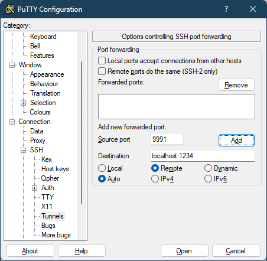

# byol

Bring Your Own LLM (into an SSH session with OpenCode).

## Overview

`byol` is a single-file Python script that configures [OpenCode](https://opencode.ai) to connect to an OpenAI-compatible LLM inference provider. It writes the provider configuration to `~/.config/opencode/opencode.json`.

The intended workflow is:

- You want opencode to work on a remote server, but with the model you're running on your local machine.
- You set up SSH to tunnel your localhost LLM HTTP server to the remote server (see instructions below)
- On the remote server, you
  - [install opencode](https://opencode.ai/docs/#install)
  - Copy / clone the `byol` script
  - Run the `byol` script either by seting up an env var (possibly through SSH), or by passing it the tunnelled LLM URL on the CLI
  - Start `opencode`, configure the provider and model to use (via the `/models` command)

### Requirements

- Python 3.10+
- Standard library only (no external packages)

### Usage

**With a URL argument:**

```bash
python byol https://api.example.com/v1
```

**With environment variable (fallback when no argument is given):**

```bash
export BYOL_OPENAPI_URL=https://api.example.com/v1
python byol
```

URL resolution priority: command-line argument first, then `BYOL_OPENAPI_URL`.

**Interactive setup:**

```bash
python byol -i
```

Prompts for URL and API key, runs an inference check, displays discovered models with the tested model marked as default, and lets you select which model to use.

### Environment variables

- `BYOL_OPENAPI_URL`: fallback endpoint URL when no CLI URL argument is passed
- `BYOL_OPENAPI_MODEL`: optional model ID override for the inference pre-check
- `BYOL_OPENAPI_KEY`: preferred bearer token for provider API calls
- `OPENAI_API_KEY`: fallback bearer token if `BYOL_OPENAPI_KEY` is unset

### What it does

- Discovers models from `<baseURL>/models`
- Runs a pre-write inference check against `<baseURL>/chat/completions`
- Adds or updates the `provider.byol` entry in `~/.config/opencode/opencode.json`
- Uses `@ai-sdk/openai-compatible` for OpenAI-compatible APIs (`/v1/chat/completions`)
- Preserves existing config entries (e.g. other providers, model, autoupdate)
- Fails safely without writing config if endpoint checks fail or config shape is invalid

### Example output

```
Inference check succeeded.
  model: qwen3.5-35b-a3b
  prompt: what's 2+2
  response: 2+2 equals 4.
  discovered_models: 5
Configured provider 'byol' at /home/user/.config/opencode/opencode.json
  baseURL: https://api.example.com/v1
```

### SSH: auto-set env var and tunnel to local LLM

When you SSH into a remote server but want OpenCode on the remote side to use an
LLM running on your local machine, you can pass `BYOL_OPENAPI_URL` via SSH
options and create a reverse tunnel in the same command.

Example (local LLM on `127.0.0.1:11434`, remote forwarded port `18080`):

```bash
ssh \
  -o SetEnv=BYOL_OPENAPI_URL=http://127.0.0.1:18080/v1 \
  -R 127.0.0.1:18080:127.0.0.1:11434 \
  user@remote-host
```

Then on the remote host:

```bash
python byol
```

How this works:

- `-R 127.0.0.1:18080:127.0.0.1:11434` exposes your local LLM port to the remote
  host as `127.0.0.1:18080`
- `-o SetEnv=...` sets `BYOL_OPENAPI_URL` in the SSH session so `byol` picks it
  up automatically

Notes:

- Your SSH server must allow the environment variable (with the
  `AcceptEnv` setting in `/etc/ssh/sshd_config`) before the `ssh` client
  can set the environment variable. A line like: `AcceptEnv LANG LC_* BYOL*`
  should exist in that config file.
- If your local LLM uses a different port or path, adjust the URL and tunnel
  ports accordingly.

#### PuTTY

Virtually all ssh clients allow tunneling. In PuTTY, it's done like this (the screenshot shows tunneling port 1234 from my local machine and making it available as port 9991 on the remote server):



(Don't forget to click the **Add** button and save the configured session!)

### Updating the model list

This tool can be called multiple time without breaking stuff. This is useful as
each time, it will re-discover models and add them to the configuration files.

### Custom local inference providers

The script works equally well just for configuring OpenCode with custom local inference
providers that expose an OpenAI-compatible API endpoint (e.g., ollama, llama.cpp,
vLLM, or any other compatible server). Just point it at your local provider's
base URL and let `byol` discover the available models automatically.

### Windows support

The script runs on Windows without modification. Use Python 3.10+ installed via
python.org, WinPython, or similar. Environment variables work the same way:

```powershell
$env:BYOL_OPENAPI_URL="http://localhost:1234/v1"
python byol.py
```

Or pass the URL directly:

```powershell
python byol.py http://localhost:1234/v1
```